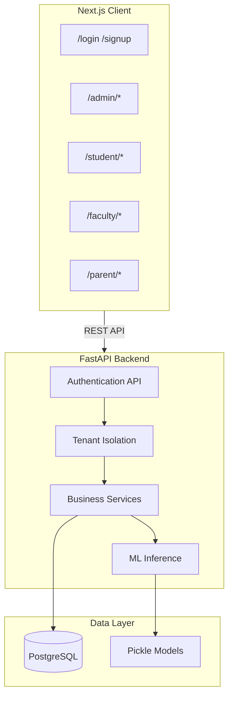
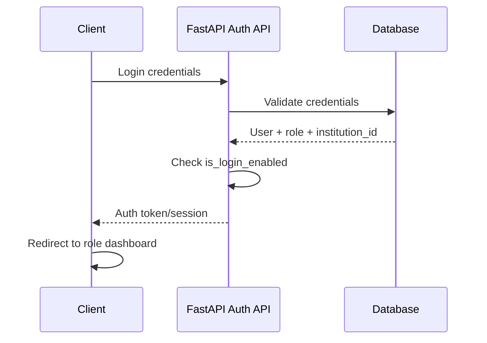

# Architecture

## System Overview

The Digital Academic Performance Monitoring and Institutional Analytics System is a monolithic software architecture with four layers:

```
Next.js Client (Bun)
        ↓
FastAPI Backend (uv)
        ↓
PostgreSQL
        ↓
ML Prediction Layer (Pickle models)
```

## Layer Responsibilities

### Next.js Client

- Single application serving all user roles (admin, student, faculty, parent)
- Role-specific route groups and layouts
- shadcn/ui components for all UI
- Communicates with FastAPI backend via REST API
- Managed with Bun

### FastAPI Backend

- REST API for all business operations
- Authentication and authorization
- Multi-tenant data isolation (backend-enforced)
- Academic data management (students, faculty, departments, subjects, etc.)
- ML inference via pickle model loading
- Managed with uv

### PostgreSQL

- Persistent storage for all tenant data
- Every tenant-owned record includes `institution_id`
- Relational data: users, students, faculty, parents, departments, subjects, attendance, examinations, performance, goals

### ML Prediction Layer

- Trained models stored as `.pkl` files in `ml/models/`
- Loaded by FastAPI at inference time via `backend/app/ml/`
- Three models: performance prediction, at-risk detection, pass/fail prediction

## Architecture Diagram



## Authentication Flow



The authentication token/session contains:
- `user_id`
- `role` (admin, student, faculty, parent)
- `institution_id` (tenant)

## Multi-Tenant Architecture

Each university/institution is an independent tenant. All data is scoped by `institution_id`. The backend derives the tenant from the authenticated session — never from client-supplied values.

See [Multi-Tenancy](multi-tenancy.md) for details.

## UI Architecture

Role-specific layouts with sidebar navigation:

| Route Prefix | Layout | Navigation |
|-------------|--------|------------|
| `/admin/*` | Admin Sidebar + Header | Institution-wide |
| `/student/*` | Student Sidebar + Header | Personal academic |
| `/faculty/*` | Faculty Sidebar + Header | Assigned students |
| `/parent/*` | Parent Sidebar + Header | Linked children |

All UI uses shadcn/ui components exclusively. No other component libraries.

## Security Rules

1. Never trust `tenant_id` from the client
2. Never trust role information from the client
3. Backend must validate authentication
4. Backend must validate authorization
5. Backend must enforce tenant isolation
6. Users can only access resources permitted for their role
7. Parents can only access linked children
8. Faculty can only access assigned students
9. Students can only access their own records
10. Disabled users cannot authenticate
11. Institution Admin can only manage their own institution
12. Analytics queries must always respect tenant boundaries

## Related Documentation

- [Authentication](authentication.md)
- [Authorization](authorization.md)
- [Multi-Tenancy](multi-tenancy.md)
- [Database](database.md)
- [API](api.md)
- [ML Pipeline](ml-pipeline.md)
