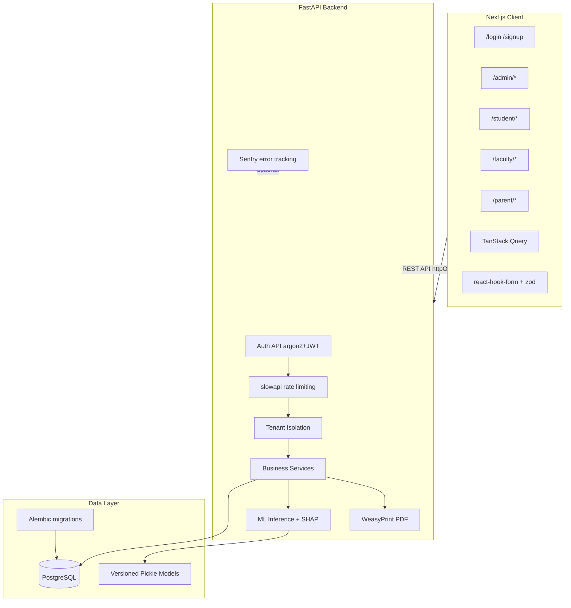
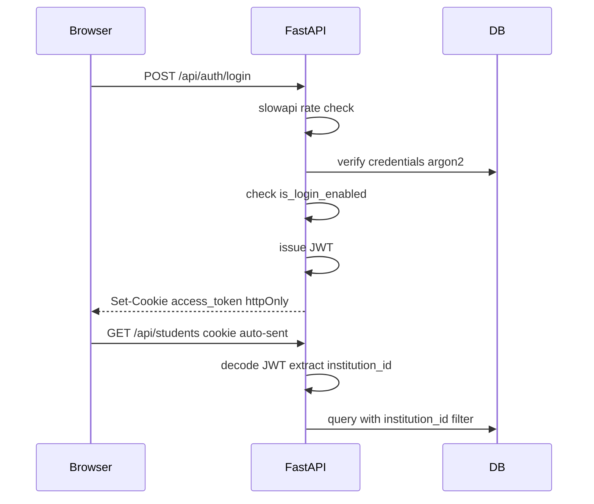

# Architecture

## System Overview

The Digital Academic Performance Monitoring and Institutional Analytics System is a monolithic software architecture with four layers:

```
Next.js Client (Bun)
        ↓
FastAPI Backend (uv)
        ↓
PostgreSQL (Alembic migrations)
        ↓
ML Prediction Layer (versioned Pickle models + SHAP)
```

## Layer Responsibilities

### Next.js Client

- Single application serving all user roles (admin, student, faculty, parent)
- Role-specific route groups and layouts with Next.js middleware guards
- shadcn/ui components for all UI
- TanStack Query for server state; react-hook-form + zod for forms
- JWT auth via httpOnly cookies (no localStorage)
- Managed with Bun

### FastAPI Backend

- REST API for all business operations
- Authentication (argon2-cffi + PyJWT) and authorization
- Multi-tenant data isolation (backend-enforced)
- Rate limiting on auth endpoints (slowapi)
- Paginated list endpoints
- PDF report generation (WeasyPrint)
- ML inference with SHAP explainability
- Schema managed by Alembic migrations
- Managed with uv

### PostgreSQL

- Persistent storage for all tenant data
- Every tenant-owned record includes `institution_id`
- Tenant-scoped unique constraints and composite indexes
- Audit fields (`created_at`, `updated_at`, `deleted_at`) on all entities
- Migrations via Alembic

### ML Prediction Layer

- Versioned models: `ml/models/{model}_v{N}.pkl` + metrics JSON
- Loaded by FastAPI at inference time via `backend/app/ml/`
- Three models: performance prediction, at-risk detection, pass/fail prediction
- SHAP explainability returned with at-risk and pass/fail predictions

## Architecture Diagram



## Authentication Flow



JWT payload: `{ sub, role, institution_id, exp }` — never trust client-supplied values.

See [security.md](security.md) for full specification.

## Multi-Tenant Architecture

Each university/institution is an independent tenant. All data is scoped by `institution_id`. The backend derives the tenant from the authenticated JWT — never from client-supplied values.

See [multi-tenancy.md](multi-tenancy.md) for details.

## UI Architecture

Role-specific layouts with sidebar navigation:

| Route Prefix | Layout | Navigation |
|-------------|--------|------------|
| `/admin/*` | Admin Sidebar + Header | Institution-wide |
| `/student/*` | Student Sidebar + Header | Personal academic |
| `/faculty/*` | Faculty Sidebar + Header | Assigned students |
| `/parent/*` | Parent Sidebar + Header | Linked children |

All UI uses shadcn/ui components exclusively. No other component libraries.

## Technology Decisions

| Area | Choice | Documentation |
|------|--------|---------------|
| Migrations | Alembic | [migrations.md](migrations.md) |
| Password hashing | argon2-cffi | [security.md](security.md) |
| Auth tokens | PyJWT in httpOnly cookies | [security.md](security.md) |
| Rate limiting | slowapi | [security.md](security.md) |
| Pagination | Offset-based `?page=&limit=` | [api-conventions.md](api-conventions.md) |
| PDF reports | WeasyPrint | [reports.md](reports.md) |
| Client data fetching | TanStack Query v5 | [frontend-stack.md](frontend-stack.md) |
| Client forms | react-hook-form + zod | [frontend-stack.md](frontend-stack.md) |
| ML versioning | `{model}_v{N}.pkl` + metrics JSON | [ml-evaluation.md](ml-evaluation.md) |
| ML explainability | SHAP | [ml-evaluation.md](ml-evaluation.md) |
| CI | GitHub Actions | [ci.md](ci.md) |
| Observability | Sentry (optional) | [infrastructure.md](infrastructure.md) |
| Dataset | Synthetic generator script | [dataset.md](dataset.md) |

## Security Rules

1. Never trust `tenant_id` from the client
2. Never trust role information from the client
3. Backend must validate authentication
4. Backend must validate authorization
5. Backend must enforce tenant isolation
6. Users can only access resources permitted for their role
7. Parents can only access linked children
8. Faculty can only access assigned students
9. Students can only access their own records
10. Disabled users cannot authenticate
11. Institution Admin can only manage their own institution
12. Analytics queries must always respect tenant boundaries

## Related Documentation

- [Security](security.md)
- [Authentication](authentication.md)
- [Authorization](authorization.md)
- [Multi-Tenancy](multi-tenancy.md)
- [Database](database.md)
- [Database Constraints](database-constraints.md)
- [Migrations](migrations.md)
- [API](api.md)
- [API Conventions](api-conventions.md)
- [ML Pipeline](ml-pipeline.md)
- [ML Evaluation](ml-evaluation.md)
- [Frontend Stack](frontend-stack.md)
- [Infrastructure](infrastructure.md)
- [CI](ci.md)
