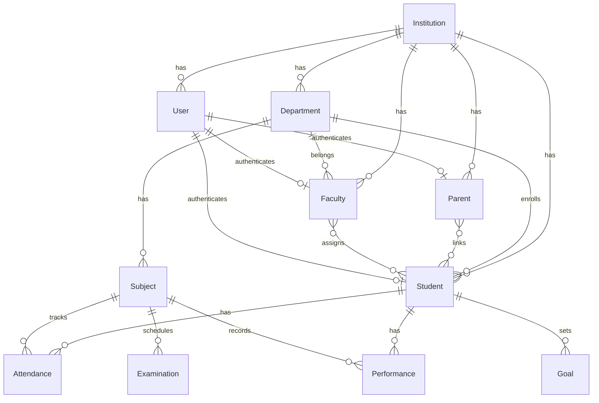

# Database Design

## Overview

PostgreSQL is the primary database. Every tenant-owned record is associated with an `institution_id` for multi-tenant isolation.

**Database tables have not been created yet.** This document describes the planned entities and relationships.

## Core Entities

### Institution (Tenant Root)

The top-level entity representing a university/institution.

| Field | Description |
|-------|-------------|
| id | Primary key |
| name | Institution name |
| logo_url | Institution logo |
| description | Short description |
| created_at | Timestamp |

All other entities reference `institution_id`.

### User

Base authentication entity for all roles.

| Field | Description |
|-------|-------------|
| id | Primary key |
| institution_id | FK → Institution |
| email | Login email (admin, faculty) |
| password_hash | Hashed password |
| role | admin, student, faculty, parent |
| is_login_enabled | Account active status |
| created_at | Timestamp |

### Student

| Field | Description |
|-------|-------------|
| id | Primary key |
| institution_id | FK → Institution |
| user_id | FK → User |
| roll_number | Unique per institution, used for login |
| name | Student name |
| department_id | FK → Department |
| program | Academic program |
| semester | Current semester |

### Faculty

| Field | Description |
|-------|-------------|
| id | Primary key |
| institution_id | FK → Institution |
| user_id | FK → User |
| name | Faculty name |
| email | Login email |
| department_id | FK → Department |

### Parent

| Field | Description |
|-------|-------------|
| id | Primary key |
| institution_id | FK → Institution |
| user_id | FK → User |
| name | Parent name |

### ParentStudent (Junction)

| Field | Description |
|-------|-------------|
| parent_id | FK → Parent |
| student_id | FK → Student |

### FacultyStudent (Junction)

| Field | Description |
|-------|-------------|
| faculty_id | FK → Faculty |
| student_id | FK → Student |

### Department

| Field | Description |
|-------|-------------|
| id | Primary key |
| institution_id | FK → Institution |
| name | Department name |
| code | Department code |

### Subject

| Field | Description |
|-------|-------------|
| id | Primary key |
| institution_id | FK → Institution |
| department_id | FK → Department |
| name | Subject name |
| code | Subject code |
| credits | Credit hours |

### Attendance

| Field | Description |
|-------|-------------|
| id | Primary key |
| institution_id | FK → Institution |
| student_id | FK → Student |
| subject_id | FK → Subject |
| date | Attendance date |
| status | present/absent |
| percentage | Running attendance % |

### Examination

| Field | Description |
|-------|-------------|
| id | Primary key |
| institution_id | FK → Institution |
| subject_id | FK → Subject |
| name | Exam name |
| exam_type | internal/final/assignment |
| max_marks | Maximum marks |
| date | Exam date |

### Performance

| Field | Description |
|-------|-------------|
| id | Primary key |
| institution_id | FK → Institution |
| student_id | FK → Student |
| subject_id | FK → Subject |
| internal_marks | Internal assessment marks |
| assignment_marks | Assignment marks |
| exam_marks | Examination marks |
| grade | Letter grade |
| semester | Semester |

### Goal

| Field | Description |
|-------|-------------|
| id | Primary key |
| institution_id | FK → Institution |
| student_id | FK → Student |
| title | Goal title |
| target | Target value |
| deadline | Target date |
| status | active/completed |

## Entity Relationships

## Tenant Isolation

Every query must filter by `institution_id` derived from the authenticated user's session. See [Multi-Tenancy](multi-tenancy.md).

## Related Documentation

- [Architecture](architecture.md)
- [API](api.md)
- [Multi-Tenancy](multi-tenancy.md)
