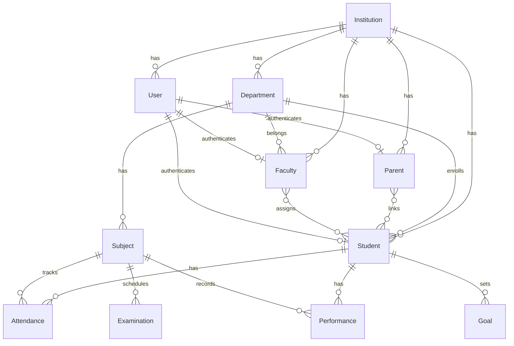

# Database Design

## Overview

PostgreSQL is the primary database. Every tenant-owned record is associated with an `institution_id` for multi-tenant isolation.

**Database tables have not been created yet.** This document describes the planned entities and relationships.

Schema changes are managed via **Alembic** migrations. See [migrations.md](migrations.md).

## Core Entities

### Institution (Tenant Root)

The top-level entity representing a university/institution.

| Field | Description |
|-------|-------------|
| id | Primary key (UUID) |
| name | Institution name |
| logo_url | Institution logo |
| description | Short description |
| created_at | Timestamp (UTC) |
| updated_at | Timestamp (UTC) |
| deleted_at | Soft delete marker (NULL = active) |

All other entities reference `institution_id`.

### User

Base authentication entity for all roles.

| Field | Description |
|-------|-------------|
| id | Primary key (UUID) |
| institution_id | FK → Institution |
| email | Login email (admin, faculty) — unique per institution |
| password_hash | argon2 hash (see [security.md](security.md)) |
| role | admin, student, faculty, parent |
| is_login_enabled | Account active status |
| created_at | Timestamp (UTC) |
| updated_at | Timestamp (UTC) |
| deleted_at | Soft delete marker (NULL = active) |

**Uniqueness:** `UNIQUE (institution_id, email)` — email is unique within an institution, not globally.

### Student

| Field | Description |
|-------|-------------|
| id | Primary key (UUID) |
| institution_id | FK → Institution |
| user_id | FK → User |
| roll_number | Unique per institution, used for login |
| name | Student name |
| department_id | FK → Department |
| program | Academic program |
| semester | Current semester |
| created_at | Timestamp (UTC) |
| updated_at | Timestamp (UTC) |
| deleted_at | Soft delete marker (NULL = active) |

**Uniqueness:** `UNIQUE (institution_id, roll_number)`

### Faculty

| Field | Description |
|-------|-------------|
| id | Primary key (UUID) |
| institution_id | FK → Institution |
| user_id | FK → User |
| name | Faculty name |
| email | Login email |
| department_id | FK → Department |
| created_at | Timestamp (UTC) |
| updated_at | Timestamp (UTC) |
| deleted_at | Soft delete marker (NULL = active) |

### Parent

| Field | Description |
|-------|-------------|
| id | Primary key (UUID) |
| institution_id | FK → Institution |
| user_id | FK → User |
| name | Parent name |
| created_at | Timestamp (UTC) |
| updated_at | Timestamp (UTC) |
| deleted_at | Soft delete marker (NULL = active) |

### ParentStudent (Junction)

| Field | Description |
|-------|-------------|
| parent_id | FK → Parent |
| student_id | FK → Student |
| created_at | Timestamp (UTC) |

### FacultyStudent (Junction)

| Field | Description |
|-------|-------------|
| faculty_id | FK → Faculty |
| student_id | FK → Student |
| created_at | Timestamp (UTC) |

### Department

| Field | Description |
|-------|-------------|
| id | Primary key (UUID) |
| institution_id | FK → Institution |
| name | Department name |
| code | Department code |
| created_at | Timestamp (UTC) |
| updated_at | Timestamp (UTC) |
| deleted_at | Soft delete marker (NULL = active) |

**Uniqueness:** `UNIQUE (institution_id, code)`

### Subject

| Field | Description |
|-------|-------------|
| id | Primary key (UUID) |
| institution_id | FK → Institution |
| department_id | FK → Department |
| name | Subject name |
| code | Subject code |
| credits | Credit hours |
| created_at | Timestamp (UTC) |
| updated_at | Timestamp (UTC) |
| deleted_at | Soft delete marker (NULL = active) |

**Uniqueness:** `UNIQUE (institution_id, code)`

### Attendance

Stores individual attendance events. **Percentage is not stored** — it is computed on read.

| Field | Description |
|-------|-------------|
| id | Primary key (UUID) |
| institution_id | FK → Institution |
| student_id | FK → Student |
| subject_id | FK → Subject |
| date | Attendance date |
| status | `present` or `absent` |
| created_at | Timestamp (UTC) |
| updated_at | Timestamp (UTC) |
| deleted_at | Soft delete marker (NULL = active) |

Attendance percentage is computed as:
`COUNT(present) / COUNT(total) * 100` per `(student_id, subject_id)`.

See [database-constraints.md](database-constraints.md) for the full computation strategy.

### Examination

| Field | Description |
|-------|-------------|
| id | Primary key (UUID) |
| institution_id | FK → Institution |
| subject_id | FK → Subject |
| name | Exam name |
| exam_type | internal / final / assignment |
| max_marks | Maximum marks |
| date | Exam date |
| created_at | Timestamp (UTC) |
| updated_at | Timestamp (UTC) |
| deleted_at | Soft delete marker (NULL = active) |

### Performance

| Field | Description |
|-------|-------------|
| id | Primary key (UUID) |
| institution_id | FK → Institution |
| student_id | FK → Student |
| subject_id | FK → Subject |
| internal_marks | Internal assessment marks |
| assignment_marks | Assignment marks |
| exam_marks | Examination marks |
| grade | Letter grade |
| semester | Semester |
| created_at | Timestamp (UTC) |
| updated_at | Timestamp (UTC) |
| deleted_at | Soft delete marker (NULL = active) |

### Goal

| Field | Description |
|-------|-------------|
| id | Primary key (UUID) |
| institution_id | FK → Institution |
| student_id | FK → Student |
| title | Goal title |
| target | Target value |
| deadline | Target date |
| status | active / completed |
| created_at | Timestamp (UTC) |
| updated_at | Timestamp (UTC) |
| deleted_at | Soft delete marker (NULL = active) |

## Entity Relationships

## Constraints and Indexes

All uniqueness constraints are tenant-scoped: `UNIQUE (institution_id, field)`.

Every tenant-owned table has an index on `institution_id`. Composite indexes cover common query patterns.

See [database-constraints.md](database-constraints.md) for the full index and constraint specification.

## Tenant Isolation

Every query must filter by `institution_id` derived from the authenticated user's session. See [multi-tenancy.md](multi-tenancy.md).

## Related Documentation

- [Database Constraints](database-constraints.md)
- [Migrations](migrations.md)
- [Architecture](architecture.md)
- [API](api.md)
- [Multi-Tenancy](multi-tenancy.md)
- [Dataset](dataset.md)
